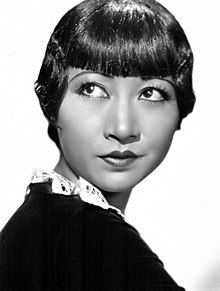

<h2>Hidden in Plain Sight</h2>
these are some women and men, immigrants from China or Chinese Americans, whom you should know but probably don't. it's never too late to rewrite the history books.

<h3>Chinese Immigrants</h3>

   

<h4>Tyrus Wong 黄齐耀, artist/animator</h4>
Tyrus Wong created the look of the film _Bambi_.

[obstacle: never received recognition for his work]

 

<h4>Chien-Shiung (Jianxiong) Wu 吴健雄, experimental physicist</h4>

Wu worked on the Manhattan Project, developing the process for separating uranium into uranium-235 and uranium-238 isotopes. She was nicknamed the Chinese Marie Curie, the First Lady of Physics and the Queen of Nuclear Research. 

[obstacle: discrimination by race/gender] The Wu Experiment in 1956 validated the theoretical proof by Yang and Lee (below) that contradicted the law of conservation of parity, directly resulting in the two men receiving the 1957 Nobel Prize (of course). 

 

<h4 style="text-align:right">T.D. (Tsung-Dao, Zhengdao) Lee 李政道 + Zhenning (Chen-ning) "Frank" Yang 杨振宁, theoretical physicists</h4>

Yang and Lee received the 1957 Nobel Prize in Physics for their work on the violation of parity law in weak interaction, showing theoretically that it is possbile to distinguish right from left and clockwise from counterclockwise. They were the first Chinese laureates.

 
 
 

#### I. M. Pei 贝夷铭 ####

 
 
 
 
 
 
 
 
 
 
 

<h4>Yitang "Tom" Zhang 张益唐, mathematician</h4>

Yitang Zhang, working completely on his own, established the first finite bound on gaps between prime numbers, making substantial progress in proving the Twin Prime Conjecture.

[obstacle: prof refused to recommend for any post after PhD, could not find work in mathematics] 

 
 

************************

### Chinese Americans ###

#### Bruce Lee 李小龙, martial artist/actor ####

 
 
 
 
 
 
 
 
 
 
 
 

   

#### Wah Chang 郑华明, artist/designer #### 
Few Star Trek fans know him by name, but they all know Wah Chang's creations: the phaser, the communicator, the tricorder, the Gorn, the first Romulan ship, the tribble, and so many more. It's hard to imagine that his name never appeared in the series's credits.

[obstacle: discrimination, lack of recognition]

 

#### Grace Lee Boggs 李玉平, activist ####
Grace Lee Boggs dedicated her life to the struggles in the African-American community.

 
 
 
 
 
 
 

#### Anna May Wong 黄柳霜, actor ####
Wong was the first Chinese American Hollywood star.

[obstacle: discrimination; typecast as oriental vixen; lost role in the good earth to white actress]
 
 
 
 
 
 
 
 

 

#### Hiram Fong 邝友良, politician ####
Fong was the a Republican senator from Hawaii from 1959 to 1977, making him the first Asian American and Chinese American to be elected to the US Senate. To this day, he is still the only Republican to have ever held a Senate seat from Hawaii. He made more history in 1964, by becoming the first Asian American to run for the Republican party's nomination for President, and held that record until 2016.

 

 

#### Michael Chang, athlete ####
Chang, at 17 years and 110 days, became the youngest male athlete to have ever won a Grand Slam at the 1989 French Open. He was the youngest athlete to have won a Grand Slam until Maria Sharapova won Wimbledon in 2004 at the age of 17 years 75 days.

 
 

 

#### Vera Wang, designer ####

 
 
 
 
 
 
 
 
 
